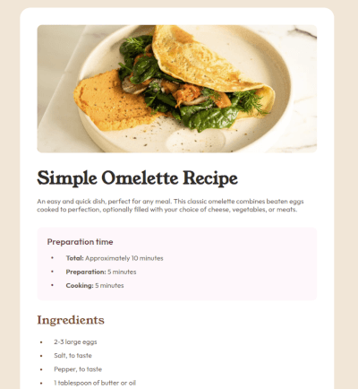

# Frontend Mentor - Recipe page solution

This is a solution to the [Recipe page challenge on Frontend Mentor](https://www.frontendmentor.io/challenges/recipe-page-KiTsR8QQKm). Frontend Mentor challenges help you improve your coding skills by building realistic projects. 

## Table of contents

- [Overview](#overview)
  - [Screenshot](#screenshot)
  - [Links](#links)
- [My process](#my-process)
  - [Built with](#built-with)
  - [What I learned](#what-i-learned)
  - [Continued development](#continued-development)
- [Author](#author)

## Overview

### Screenshot

### Links

- Solution URL: [Review Code](https://github.com/marefpceo/fem-recipe-page)
- Live Site URL: [Live preview](https://marefpceo.github.io/fem-recipe-page/)

## My process

### Built with

- Semantic HTML5 markup
- CSS custom properties
- Flexbox
- Mobile-first workflow

### What I learned

Major learning from this challenge mainly included defining a strategy for css. After some research, I decided on a flat folder structure with an adaptation of CUBE CSS.

### Continued development

Moving forward, I will continue to learn and implement best practices and choosing a workflow that suites the challenge. 

### Useful resources

- [MDN Web Docs](https://developer.mozilla.org/en-US/) - I use this site as reference and to ensure I am coding with best practices in mind. 

- [CUBE CSS](https://cube.fyi) - This site was used to reference and understand a different methodology than what I have used before.

## Author

- Website - [Lamar](https://www.lamar-stevens.com)
- Frontend Mentor - [@marefpceo](https://www.frontendmentor.io/profile/marefpceo)
- Twitter - [@stevens14704](https://www.twitter.com/stevens14704)
